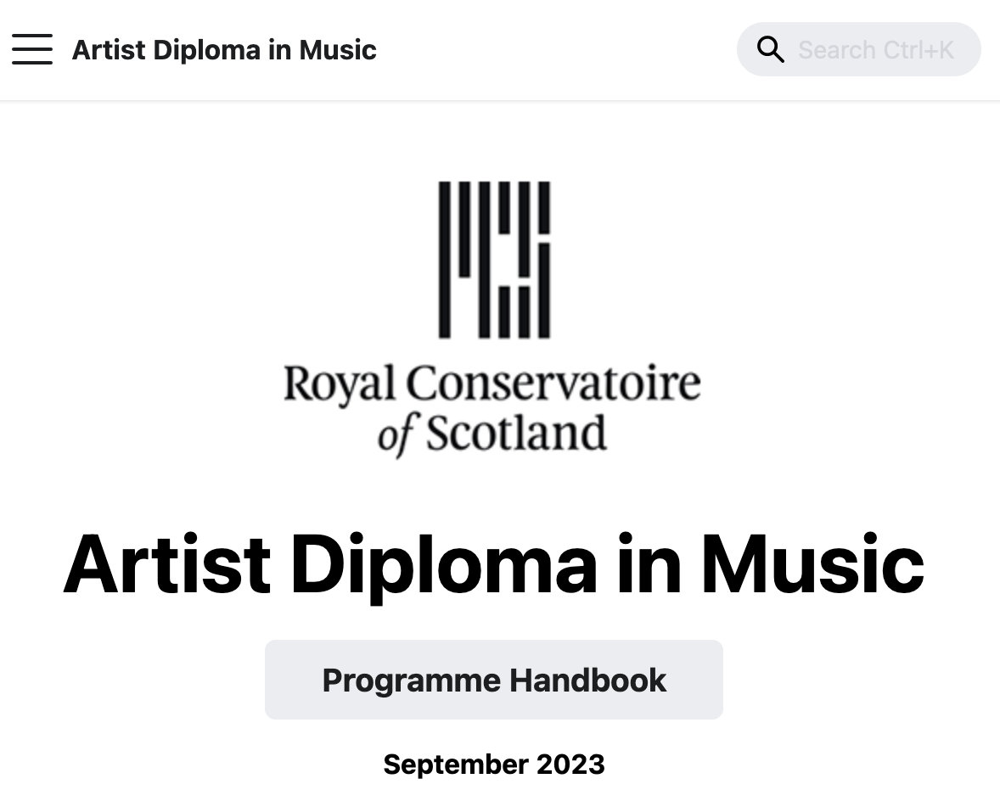

# Handbook template

### Notes
* Removed ALL CAPS
* Removed legal numbering (and corresponding indent) – handbook sections can be referred to by static links, eg [handbook_template#academic-entry-requirements](handbook_template#academic-entry-requirements)
* Simplified and clarified headings
* Used sentence case for headings (Instead of Title Case)
* Used only three levels of heading after the title (mostly just two levels)
* Removed 'Enter text here'
* Removed some stray trailing colons, like this one:
* Removed typist's double spaces and trailing whitespace
* Suggested alternatives to tables
* See also draft module descriptor [Title of the Module](module_template)
* Not included rubrics yet: tabular format problematic for online delivery, although see here [MMus/MA Matrix](/handbook/grading_matrix)
	

---

### School of Music / School of Drama, Dance, Production and Film

## Name of Programme

### Programme Handbook

### Month and Year

Comment: this section is a placeholder for a front cover. Online landing page would look something like this:

 

---

## Welcome

Comment: removed redundant long heading 'History & philosophy of your programme, national and international context'.

### Your responsibilities

Comment: Original heading was 'Your responsibilities as an RCS student' – simplifed to 'Your responsibilities'. Does this need to be a subheading? Is this the right place for this information? This is not now all thoroughly updated in the Rules and Regs?

## Programme specification

Removed redundant heading 'Programme summary details'.

### Programme title

Comment: or, 'titles', there  may be more than one.

### Duration

### Mode(s) of study

Comment: in final document should read either 'Mode' or 'Modes'. Also, what is meant here: does this refer to part/full time, or is it about in-person versus remote study?

### Credit framework 

Comment: appropriate use of table here.

Comment: some programmes with multiple strands/levels may need more complex tables here.

| Award | SCQF level | SCQF credits | ECTS credits |
|--|--|--|--|
| text | 7 | 10 | 5 |
|text | | | |
	
			
### Exit awards

Comment: have moved this section *after* credit framework, as it seems more logical. Have retained suggested table below, althought not clear to me how that would be used.
			
| Exit award | Years | Terms |
|--|--|--|
| text | 1 | 4 | 
| | | | 

### Period of validity

Comment: simplified from three headings to one heading with three bullet points.

* **Validation** June 2024
* **Start date** September 2024
* **Next review** 2029

### Curriculum Principles

The Conservatoire Curriculum:
1.	Develops excellence alongside high levels of reflection in all of our disciplines.
2.	Fosters the creative attitudes and skills needed for collaborative learning in and through practice.
3.	Enables students to take responsibility for managing and evaluating their own learning.
4.	Provides students with insight into a diversity of artistic fields and experience of what is required to succeed in their individual arts practice.
5.	Develops the ability to use theoretical understanding to inform practice and practice to inform theory.
6.	Enables students to make a contribution in the world as artists, educators, advocates and active citizens. 

Guidance note: specify how your programme will deliver the Conservatoire curriculum principles.  Describe the core values and philosophy of your programme content and design.

Comment: I've removed a long subheading heading 'Core Values/Philosophy and Relationship to Rcs Vision/Strategy/Curriculum Principles', which reads more like a guidance note. 'Curriculum Principles' is now the subheading.

### Programme aims

Comment: original subheading here was 'Graduate level programme aims', simplified to 'Programme aims'. (Clarification possibly needed in future for UG programmes with multilple SCQF levels that these are the aims at the final level of the programme?)

The programme aims to:

* Develop…
* Promote…
* Nurture…
* Enable…
* Provide…
* Cultivate…
* Empower…

### Programme learning outcomes 

Upon completion of the programme of study you will be able to:

1. Demonstrate…
2. Project…
3. Synthesise…
4. etc

### Academic entry requirements

Comment: replaced current heading 'Admission criteria' with three more specific headings, 'Academic entry requirements', 'Language of study' and 'Target numbers'.

### Language of study

### Target numbers

Comment: no longer stating different categories of student (Scottish, RUK, International)

| Minimum intake | Maximum intake |
| -- | -- |
| | |

### Description of applicants 

Comment: how is this different from 'admission criteria'?

### Programme content

| Module title | SCQF Credits |
| -- | -- |
| title | 20 |
| title | 10 |
| etc |  |

Comment: the template suggests two different tables for core modules versus electives/options. This might or not make sense depending on the programme: suggest that different programmes might need to tabulate this information in different ways. For instance:

| Module | SCQF Credits | Status |
| -- | -- | -- |
| title | 20 | Core |
| title | 10 | Elective |
| etc |  | | 

### Programme learning outcomes by module

Comment: the original subheading here was 'Learning outcomes by level (programme overview), and curriculum progression', which is confusing. The table is a mapping of programme learning outcomes to modules, which is how I have titled it. In the case of programmes that subsume more than one SQQF level, possibly PLOs per level?

|  Module | PLO1  | PLO2  | PLO3  | PLO4  | PLO5  | PLO6 | PLO7 |
|---|---|---|---|---|---|---|---|
| title  | &check; |  &check; |  &check; |    |     | | |
| title | &check;  |    |  &check; |   |  &check;  | | |
| etc |   |    |   |   |  &check;  | &check; | &check; |

### Benchmarks

Comment: original subheading was 'Benchmarks used for Programme Level Outcomes and level Learning Outcomes (e.g. SCQF, QAA Benchmark, FHEQ, RCS Graduate Attributes, European benchmarks etc.)' – simplified to 'Benchmarks'

Guidance note: please list the benchmarks that have been utilised when designing your programme and describe the ways in which these have been applied.

Comment: it's interesting that nowhere do we have to actually _demonstrate_ the benchmarking, just _say_ that we have benchmarked. Older versions of our programme specifications had extensive tables explicitly showing mappings to QAA, SCQF and in some cases European benchmarks. The current BMus handbook incorporates one such table.

To do: include an example of a benchmark mapping table here. Could be tricky: not easy to present complex tables in online format!

### Areas of study

Comment: original subheading was 'Areas of study in programme (e.g. strands)' – simplified. Where a single programme has multiple awards/strands/areas it might make more sense to note that above under 'Programme title'.

### Learning and teaching methods 

Guidance note: please refer to the RCS Learning and Teaching Strategy, outlining the ways in which your Programmes aligns with the vision, mission and values as set out in the Strategy (extract below):

Comment: should excerpt below of the Strategy 2030 be repeated in the programme document? Or is this just included here for reference?

#### Institutional Vision
A community that nurtures, supports and celebrates inclusive art making from grass roots to world-leading performance and production

#### Institutional Mission
For our education and research in the arts to be the catalyst to shape the future of art forms, artists and society

#### Three perspectives:
People: developing student voice and experience, staff skills and practice, partnerships, graduate outcomes and continuously enhancing artistic quality and impact

Place: developing RCS as a civic presence in Glasgow, the national conservatoire for Scotland and a world-leading international reference for progressive arts education, practice and knowledge exchange

Promise: Generating significant additional income (giving and commercial), targeted growth supporting financial sustainability and investment in future artistic and educational developments, students, staff and quality enhancement

#### Values
* Creative courage
* Compassion
* Constructive challenge
* Curiosity
* Craft, rigour and talent
* Community 

## Assessment
	
[Guidance note: describe your approach to designing and implementing assessment in line with the Learning and Teaching Strategy]

Commment: this feels like the assessment from the perspective of validation. Where does a student find out what they actually have to *do* to pass?

Comment: perhaps there things missing from the template here. The Conservatoire Common Assessment Scale? Some guidance on plagiarisim and academic misconduct, signposted to the Rules & Regs? Graduation costs? 

### Assessment modes

Guidance note: select from the indicative list below or augment with assessment modes specific to your programme. Remove the list of assessment modes from the final document.

Modes of assessment:
* Self-Assessment Report/Reflective Journal
* Essay/Dissertation 
* Written Examination
* Assessed Recital/Performance/Exercise/Rehearsal
* Presentation
* Continuous Observation
* Portfolio
* Viva
* Pecha Kucha

| Module | Mode of assessment | Outcome |
| - | - | - |
| Principal Study | Performance | Graded |
| Supporting Studies | Observation of Working Practice | Pass/Fail |
| etc | Portfolio | Pass/Fail |

Comment: reasonable use of a table here: see also below

### Feedback

Original heading was 'Types of feedback - suggest just 'Feedback'

Guidance note: please either select from the indicative list below or detail additional types of feedback relevant to your programme. Remove list of feedback modes from final document.

Feedback Modes:

* Mutually constructed feedback
* Seminar
* Tutorial
* Written feedback
* Oral feedback
* Peer review
* Student contract 

Comment: this might be combined with the table above, eg:

| Module | Mode of assessment | Outcome | Feedback |
| --- | --- | --- | --- |
| Principal Study | Performance | Graded | Written |
| Supporting Studies | Observation of Working Practice | Pass/Fail | Written |
| etc | Portfolio | Pass/Fail | Written |

Comment: in the MMus/MA handbook, this section is used to explain to students what we _mean_ by feedback, formative and summative, and give a narrative around the kinds of feedback used in different contexts. It is more nuanced than a bare list or table.
 
### Assessment calendar

Comments: this very wide table – landscape format in word – is not practical for online delivery, especially on mobile.

(It also implies clean and predetermined sequencing between teaching, assessment, grading and feedback. For the MMus/MA programme, many assessments are either continuous or variable, dependent upon the year-on-year scheduling of particular public performances. This table has therefore never appeared in the MMus/MA handbook: instead a more nuanced narrative is used, alongside information in the Calendar under Learning Environment.)

An alternative approach that could be explored would be to link to a shared Outlook calendar that outlines the timetabling of assessment for the programme in question, and/or highlight the student's Asimut calendar, which is where assessment deadlines ultimately appear.

#### Term 1

| Module | Credits | Assessment | Weighting or Pass/Fail | 1 | 2 | 3 | 4 | 5 | 6 | 7 | 8 | 9 | 10 | 11 | Options |
| --- | --- | --- | --- | --- | --- | --- | --- | --- | --- | --- | --- | --- | --- | --- | --- |
| title | 20 | Portfolio | P/F | P | P | P | P |  | S | A | G |  |  | F |  |
|  |  |  |  |  |  |  |  |  |  |  |  |  |  |  |  |
|  |  |  |  |  |  |  |  |  |  |  |  |  |  |  |  |
|  |  |  |  |  |  |  |  |  |  |  |  |  |  |  |  |
|  |  |  |  |  |  |  |  |  |  |  |  |  |  |  |  |
|  |  |  |  |  |  |  |  |  |  |  |  |  |  |  |  |
|  |  |  |  |  |  |  |  |  |  |  |  |  |  |  |  |
|  |  |  |  |  |  |  |  |  |  |  |  |  |  |  |  |
|  |  |  |  |  |  |  |  |  |  |  |  |  |  |  |  |

A = Assessment; F = feedback; G = grading; P = process (time spent engaged in ongoing activities); S = week of submission; V = variable assessment week (assessment may take place at any time within the identified weeks).
 
### Progress and resit regulations

Comment: the original title was 'Programme Specific Progress and Resit Regulations': 'Programme Specific' seems redundant as part of the heading.

Guidance note: detail any programme specific progress and resit regulations not already included in centralized RCS rules and regulations

Comment: include link to the Rules & Regs.

## Learning environment

Guidance note: append appropriate guidelines for programme specific practice(s)

Guidance note: Reference could be made to relevant sections of the [RCS General Rules and Regulations](https://portal.rcs.ac.uk/qualityassurance/rules-and-regulations/), Dignity at Work and Study Policy, and Fitness to Study Policy

### Student support

Comment: subheading was 'Support for Students (Academic, Pastoral)', changed to simpler and more direct 'Student support'

Guidance note: details of the support that is available for Students, both academic and pastoral, can be found on the [Student Support Portal Page](https://portal.rcs.ac.uk/student-support/).

### Disability support

Comment: subheading was 'Support and Specialist Provision for Students With a Disclosed Disability', simplified

Guidance note: information related to Disability Support available at RCS can be found on the [Disability Support Portal Page](https://portal.rcs.ac.uk/disability-support/)

### Improving the programme

Comment: subheading was 'Feeding Back to Your Programme Leader(s) and Other Staff (Including Programme Committee)'. I've suggested 'Improving the programme' instead.

https://portal.rcs.ac.uk/prog-comms

### Internationalisation

Guidance note: Details of support for non-UK students can be found on the [International Student Portal Page](https://portal.rcs.ac.uk/international-students/).

Details of Student Exchange (Turing Scheme) can be also be found on the Portal.

### Work-based learning

[Guidance note: The RCS Quality Assurance Handbook Section 11 (QAH 11) provides further details on placement learning]

### Health and safety

#### Safe Space Statement
The Royal Conservatoire of Scotland is fully committed to creating an environment where all staff and students treat each other fairly and with mutual respect, and to providing an environment where all students and staff are free from discrimination and intimidation.

The following Safe Space Statement applies to all activity happening within the Conservatoire, from early years classes to our Masters programmes.

> Everyone working and learning together in this room is entitled to do so in a safe space: a space free of bullying and harassment of any kind. We will honour our differences and collaborate in the true spirit of ensemble, promoting creative challenge whilst retaining the utmost respect for each other. We will treat one another with courtesy and respect at all times, and if we are subjected to or witness bullying or harassment we will speak out knowing that our voices will be heard and we will be taken seriously. We will actively promote a positive, optimistic and mutually supportive approach to work and study. Together we can create a Safe Space.

Guidance note: Details Related to Health, Safety and Wellbeing Can Be Found on the Rcs Portal at https://portal.rcs.ac.uk/health-safety/

### Equality and diversity

We welcome a diverse population of staff and students. Further, we are committed to promoting equality in all of our activities and we aim to provide a performing, learning, teaching, working and research environment free from unlawful discrimination against applicants, staff and students on the grounds of gender (actual or perceived), sexual orientation, disability, race, colour, nationality, national or ethnic origin, marital status, age and actual or perceived religious or similar belief.

The Conservatoire fosters a learning, teaching, research and working culture which not only supports diversity, inclusion and equity but indeed requires those principles. We are thoroughly committed to the promotion of equal opportunities across all of our functions and practices including those of learning and teaching, employment, representation, decision making, and procurement and partnerships.

The Conservatoire is committed to ensuring that those from all backgrounds feel able to apply to study with us. Applicants who have been looked after at home, in residential care, foster care or kinship care can access support via the International and Student Experience team at welfare@rcs.ac.uk. Provisions are also made for Estranged Students and Student Carers.

Guidance note: Details can be found on the [Equality, Diversity and Inclusion Portal Page](https://portal.rcs.ac.uk/equality-diversity-inclusion-edi/). Demonstrate how your programme meets the criteria as set above

### Learning resources

Comment: subheading was 'Technology and Learning Resources/Modes (E.G. VLE)' – simplified and generalised to 'Learning resources', not ghettoising technology :)

### Staff

[Guidance note: details of Staff Development Resources can be found on the Portal]

Comment: why would staff development resources be included in a student handbook?

### Copyright

Subheading was 'IPR, copyright etc.', simplified and clarified to just 'Copyright'

[Guidance note: No further information is required to be entered here in addition to the text below.]

The RCS General Rules and Regulations (Section 10) state:

> It is the responsibility of all staff and students of the Conservatoire to ensure that they comply with the provisions of the Copyright, Designs and Patents Act 1988 (‘the Act’). Breach of copyright regulations is a criminal offence and may expose both the individual and the Conservatoire to prosecution.
> 
> In simple terms, copyright in a literary, dramatic, musical or artistic work exists during the author’s lifetime and for a period of 70 years from the end of the calendar year in which the author dies. During this period, a work may not be copied without the permission of the rights or licence holder. Publishers, editors, artists, photographers and arrangers also have rights over a work. Advice on copyright issues is available from the Head of Information Services and all policies and guidelines are available on the Portal Copyright pages.

Further details can be found under Section 10 of the General Rules and Regulations and on the Portal Copyright pages.

### The student contract

Comment: at some point we should tackle the fact that we now have _two_ things called 'Student Contract' – the one that students sign at matriculation, and the online one.

### Transitions

Comment: subheading was 'Transitions Tutor Role', simplified to 'Transitions'

### Communication

Comment: subheading was 'Communication in Department/Programme', simplfied and clarified to 'Communication'.

### Working week

### Independent study, autonomous learner, reflective practitioner

Comment: it's very odd that such fundamental matters – particularly for masters programmes! – are relegated to this distant subheading. Should these points not be addressed much earlier in the document?

## Modules

See draft [Title of the Module](module_template)

